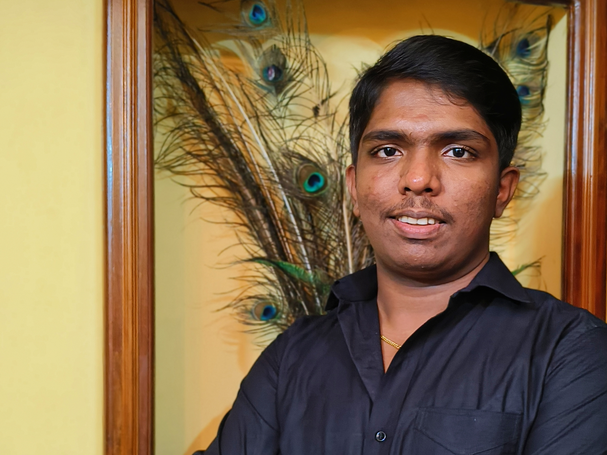

<!-- 

# Hi 👋, I'm Yadav P

### 💻 Full Stack Developer | 🤖 ML Enthusiast | 🚀 Problem Solver

 -->
<table>
<tr>
<td width="180" align="center">

</td>

<td align="left">

# Hi 👋, I'm Yadav P

### 💻 Full Stack Developer | 🤖 ML Enthusiast | 🚀 Problem Solver

</td>
</tr>
</table>

---

# Hi 👋, I'm Yadav P

🎓 Computer Science Engineering Student  
💻 Full Stack Developer | Machine Learning Enthusiast  
🚀 Passionate about building real-time intelligent web applications  

---

## 🚀 About Me
- 🔭 Currently working on **Real-Time Yoga Pose Detection & Correction System (ML + Flask)**
- 🏗 Building **Complaint Management System using Laravel**
- 🌱 Learning **Deep Learning, System Design, Advanced Laravel**
- 👯 Looking to collaborate on **AI/ML & Web Development Projects**
- 📫 Reach me at: yadavp.2026@gmail.com

---

## 🛠️ Tech Stack

### 💻 Languages

### 🌐 Web Development

### 🤖 Machine Learning

---

## 📌 Featured Projects

### 🧘 Real-Time Yoga Pose Detection & Correction
- Deep Learning based pose classification
- Live webcam tracking using OpenCV
- Angle-based posture correction
- Audio + Text feedback system
- Flask Web App deployment

### 🛠 Complaint Management System (Laravel)
- Role-based authentication (Admin/Manager/Client)
- Complaint assignment workflow
- Notifications & forwarding system
- Dynamic AJAX forms
- Dashboard analytics

---

## 📊 GitHub Stats

---

## 🌟 Goals for 2026
- ✅ Publish ML research/project
- ✅ Contribute to open source
- ✅ Build production-level SaaS apps
- ✅ Master system architecture

---

## 🤝 Connect With Me

---

⭐️ From [YADAV P](https://github.com/YADUMOCO)

⭐ Inspired By [Jison Joseph Sebastian](https://github.com/nosij-playz)
